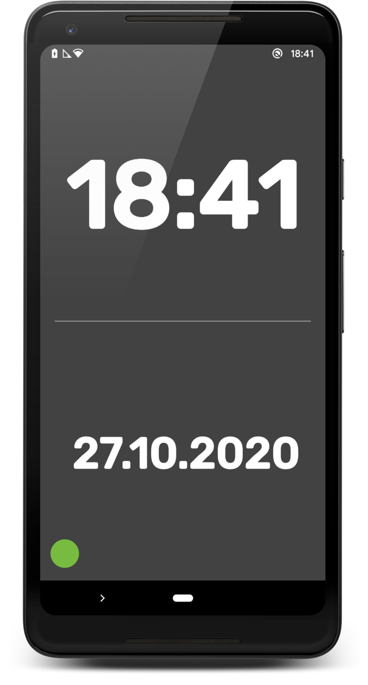
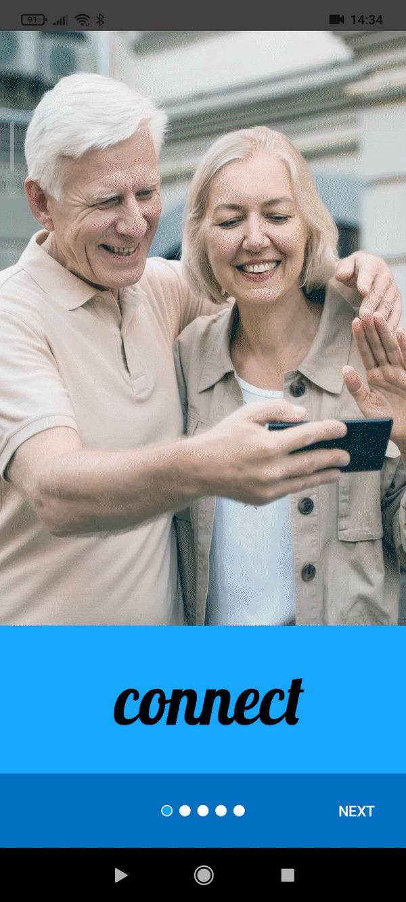

# Connect  👦📱👵 ---- testers explainaiton, below :)

 During the COVID-19 pandemic 🦠, many people was stuck in their homes, ALONE - Especially, our grandparents.
One way to keep in touch with our families and friends - WhatsApp video calls! 📹  
 Most of the seniors don't have a smartphone or a tablet to communicate with their families with video calls.  
 Even if they have a smartphone, it is very difficult for them to use this video calls feature.

### So...  What is  *Connet* ?
 *Connet* is an app (for all android devices!) that has only one purpose - making the video call procedure simple, **extremely easy** and accessible! ✌️

### but... how does it work?
simple!
First, open your drawer, and take one of your on smartphone (we all know that you have **few** like this😜),  
install *Connect* and place the smartphone in your grandparents home.

And than, 3 steps:
- When your grandparents want to make a video call, they simply calling you with their land line phone, and asking you to make the video call
- You make the video call using *Whatsapp*
- They answering by pressing the bigggg green button! 💚

Simple right?
This way, your grandparents don't need to learn how to use smartphone, WhatsApp and all others confusing apps.

### ok ok ok... how does it look like?
That's what we really like about *Connect*. Even your סבתא פולנייה will like it!
When nobody is calling (idle mode), the screen will be open and the time & date will shown.

### Few GIFs for demo
#### Onboarding screens with instructions

#### Incoming video call

# FOR TESTERS!
The app need to run on **Physical** Android device, with *Whatsapp* working on it.
After the Onboarding screens, the setting screen will open and you will need to allow the app to listen to WhatsApp notifications (listen only to the **kind** of messages - text, video call or regular call, not the content!).
After allowing this permission, you can start accepting video calls.

## About me -
My name is Yuval, CS student from Haifa Univ., graduating at the end of this semester (February).  
I have 3 years of experience in Android development - 1.5 years from my recent job (you can see it in my [Linkedin profile](https://www.linkedin.com/in/yuvaltamir/)) and 1.5 years from many many personal projects.  
I have a strong passion for developing mobile apps (Android and cross platform - Flutter),  
and I'm looking for a junior position after graduating (in February - wow it's very close 🥳).  
I really enjoyed working on this *Connect* project, and hope that you will also like it.  
### Thanks, Yuval
